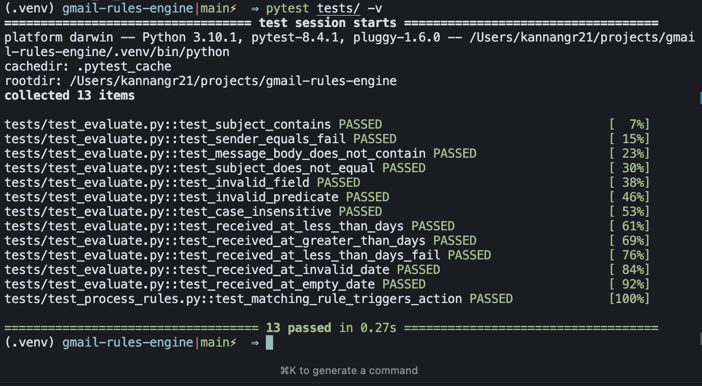

# Gmail Rules Engine

A scalable, modular Python application that integrates with Gmail API to automate email processing based on configurable rules. Designed with maintainability in mind — using token caching, an authentication layer, and a config-driven rules engine.

# Description

This project automates Gmail email processing by:
- Fetching and caching emails locally from the Gmail API
- Applying rules (defined in a JSON config file)
- Executing matching actions (e.g. mark as read, move to label)

# Features

- **Google OAuth 2.0** Integration with token caching
- **Config-driven** Rules Engine
- **Modular** codebase for easy testing and extension
- Includes **unit and integration** tests

# Installation

1. Clone the repositpory
```
git clone https://github.com/kannangr21/gmail-rules-engine.git
cd gmail-rules-engine
```

2. Create a Virtual Environment
```
virtualenv .venv
source .venv/bin/activate 
```

3. Install Dependencies
```
pip install -r requirements.txt
```

4. Setup Gmail API Access
- Go to Google Cloud Console
- Enable the Gmail API
- Create OAuth 2.0 Credentials (App Type: Desktop)
- Download the `credentials.json` and place it in the project root

# Usage
To run the pipeline (fetch + process), use:
```
python main.py
```
This will:
1. Authenticate with Gmail
2. Fetch and cache new emails in emails.db
3. Apply rules from rules_engine/rules.json
4. Perform actions on matched emails

To run the pipeline and wish to specify the number of emails to fetch, pass it as a system argument
```
python main.py 25
```
This process for last 25 emails, the default value is set to 10

# Configuration

`rules_engine/rules.json`
```
{
  "predicate": "any",
  "rules": [
    {
      "field": "subject",
      "predicate": "contains",
      "value": "invoice"
    }
  ],
  "actions": [
    "mark_as_read",
    { "type": "move_to_label", "value": "Finance" }
  ]
}
```
**predicate**: `"any"` or `"all"` — logical grouping of rule conditions

**rules**: 
- field: subject, sender, message_body, received_at, etc.
- predicate: contains, equals, does_not_equal, greater_than_days, etc.
- value: The value to match

**actions**: mark_as_read, mark_as_unread, move_to_label

# Testing

- Unit tests (e.g., predicate evaluations)
- Integration tests (e.g., end-to-end rule execution)  
- `pytest tests/ -v` will run the test cases  



# Structure
```
.
├── main.py                  # Entrypoint to run both fetching and processing
├── auth.py                  # Gmail OAuth 2.0 logic with token caching
├── fetch_emails.py          # Email fetching and SQLite insertion
├── utils.py                 # Shared utility functions
├── credentials.json         # Your OAuth credentials
├── token.json               # Cached access/refresh tokens
├── emails.db                # SQLite database for storing fetched emails
│
├── database/
│   └── db.py                # Database schema, connection logic & methods
│
├── rules_engine/
│   ├── process_rules.py     # Core rules engine logic
│   ├── actions.py           # Available email actions
│   ├── fields.py            # Field extraction helpers
│   ├── predicates.py        # Logical predicate implementations
│   └── rules.json           # Rule configuration file
│
├── tests/
│   ├── test_evaluate.py     # Unit tests for rule evaluation
│   └── test_process_rules.py# Integration tests
│
├── requirements.txt         # All dependencies
└── README.md
```
